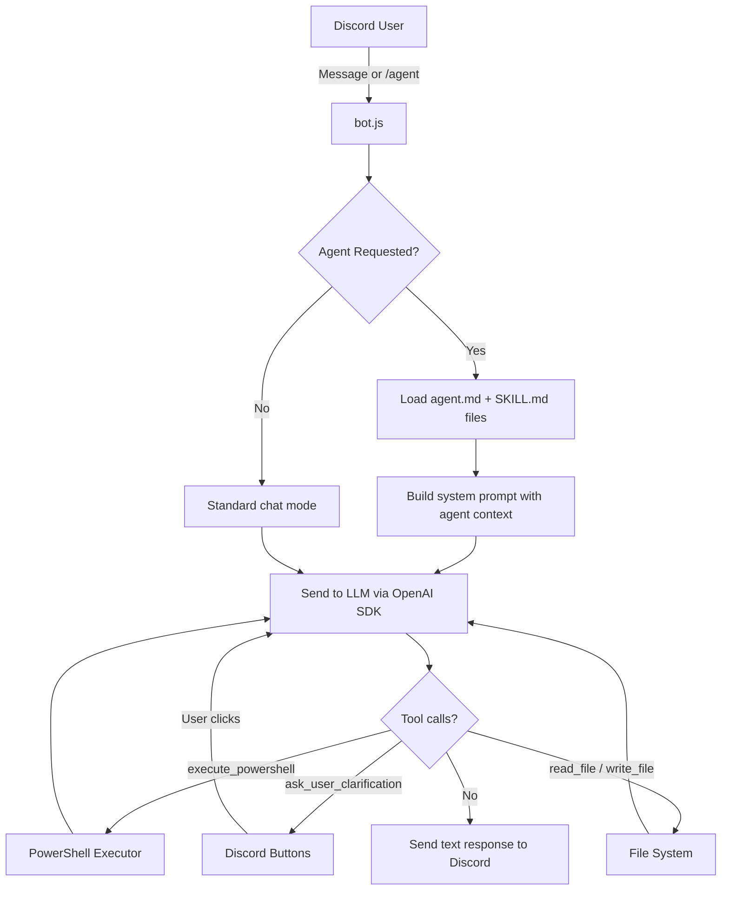

<div align="center">
    <h1>🌉 AI-Discord-Bridge</h1>
    <h3>An agentic Discord bot that bridges your chat server to local AI models with PowerShell automation, dynamic agents, and interactive feedback.</h3>
</div>

---

## What Is This?

AI-Discord-Bridge connects your Discord server to a **locally-running AI model** (via [Ollama](https://ollama.com) or [LM Studio](https://lmstudio.ai)) and extends it with an **agentic framework**. You can chat casually, or invoke specialized AI agents that have domain-specific knowledge, skills, and the ability to execute PowerShell on your machine — all from Discord.

### Key Capabilities

| Feature | Description |
|---|---|
| 🤖 **Multi-Backend AI** | Auto-detects and hot-swaps between Ollama and LM Studio every 10 seconds. No restart needed. |
| 🧠 **Agent System** | Invoke specialized agents (`/agent` slash command) like Bridge (orchestrator), PS-Dev (PowerShell), Architect, Analyst, or Tutorial Writer. Each agent loads its own context and skills. |
| 🛠️ **Skill Auto-Loading** | When an agent is invoked, its referenced skills are automatically parsed and injected into the AI context. |
| 💻 **PowerShell Execution** | The AI can run `pwsh` commands in a sandboxed project directory, read/write files. |
| 🔒 **Safe Mode** | Destructive commands (`Remove-Item`, `Stop-Process`, etc.) are blocked and presented as **Approve / Deny** buttons in Discord. |
| 🤔 **Interactive Clarification** | When the AI needs information, it sends Discord buttons for you to click — no typing needed. |
| 📎 **File Analysis** | Drag-and-drop `.ps1` or text files into chat for the AI to analyze. |

---

## Quickstart

### Prerequisites

- [Node.js](https://nodejs.org) v18+
- [PowerShell 7 (`pwsh`)](https://learn.microsoft.com/en-us/powershell/scripting/install/installing-powershell-on-windows) on PATH
- [Ollama](https://ollama.com) **or** [LM Studio](https://lmstudio.ai) installed with a model loaded

### Setup

```bash
git clone https://github.com/your-org/AI-Discord-Bridge.git
cd AI-Discord-Bridge
npm install
cp .env.example .env
# Edit .env with your Discord token, channel IDs, and model name
npm start
```

### Discord Bot Setup

1. [Discord Developer Portal](https://discord.com/developers/applications) → New Application → Bot tab.
2. Enable **Message Content Intent** and **Server Members Intent**.
3. OAuth2 → URL Generator → Select `bot` scope + Administrator → Invite to your server.

### Environment Variables

| Variable | Required | Description |
|---|---|---|
| `TOKEN` | ✅ | Discord bot token |
| `MODEL` | ✅ | Model name (e.g., `gemma4:26b`, `qwen2.5-coder`) |
| `CHANNELS` | ✅ | Comma-separated Discord channel IDs to listen in |
| `OLLAMA` | ❌ | Ollama URL (default: `http://localhost:11434`) |
| `LM_STUDIO_URL` | ❌ | LM Studio URL (default: `http://localhost:1234/v1`) |
| `PROJECT_DIR` | ❌ | Sandbox directory for PowerShell execution (default: `cwd`) |

> **Tip:** You can configure both `OLLAMA` and `LM_STUDIO_URL`. The bot auto-detects whichever is online.

---

## How to Use

### Casual Chat
Mention the bot in a configured channel:
> `@Kitty what's the weather like?`

### Slash Command: `/agent`
Type `/agent` in Discord to get a UI with:
1. **Agent dropdown** — Select which agent to invoke (Bridge, PS-Dev, Architect, Analyst, Tutorial Writer)
2. **Prompt field** — Your request

### Text-Based Agent Invocation
You can also invoke agents via regular messages:
- First word: `@Kitty bridge build me a script to...`
- Explicit parameter: `@Kitty agent: ps-dev create a module for...`
- Tag syntax: `@Kitty @bridge handle this request...`

### Interactive Buttons
When the AI needs clarification, it will send a message with clickable buttons. Click your choice and the AI continues automatically.

### Safe Mode
If the AI tries to run a destructive PowerShell command, it will pause and show **Approve** / **Deny** buttons. Nothing executes without your explicit approval.

### Bot Commands
| Command | Description |
|---|---|
| `.help` | Show available commands |
| `.reset` / `.clear` | Clear conversation history |
| `.model` | Show current model name |
| `.system` | Show current system message |
| `.ping` | Latency check |

---

## Project Structure

```
AI-Discord-Bridge/
├── src/
│   ├── index.js              # Shard manager (entry point)
│   ├── bot.js                # Core bot logic, message handling, agent loop
│   ├── meklog.js             # Logging utility
│   ├── agents/               # Agent definition files (*.agent.md)
│   │   ├── bridge.agent.md
│   │   ├── ps-dev.agent.md
│   │   ├── architect.agent.md
│   │   ├── analyst.agent.md
│   │   └── tutorial-writer.agent.md
│   ├── skills/               # Skill definition files (SKILL.md per folder)
│   │   ├── apply-cbh-standard/
│   │   ├── jargon-simplifier/
│   │   ├── pester-runner/
│   │   └── ... (12+ skills)
│   ├── commands/             # Discord slash command definitions
│   │   ├── commands.js       # Command registry
│   │   ├── agent.js          # /agent slash command
│   │   └── text2img.js       # /text2img slash command
│   └── powershell/           # PowerShell execution engine
│       ├── executor.js       # Sandboxed command execution
│       └── tools.js          # OpenAI tool definitions
├── docs/                     # Project documentation
├── .env.example              # Environment variable template
└── package.json
```

---

## Documentation

| Guide | Description |
|---|---|
| [Ollama Setup](docs/ollama-setup.md) | Download, install, and configure Ollama |
| [Discord Bot Setup](docs/discord-bot-setup.md) | Create your Discord app, get your bot token, and set permissions |
| [Adding Agents](docs/adding-agents.md) | How to create and register a new agent |
| [Adding Skills](docs/adding-skills.md) | How to create a new skill for agents |
| [Adding Tools](docs/adding-tools.md) | How to add new tools the AI can call |
| [Discord Features](docs/discord-features.md) | Buttons, slash commands, and interactive UI |
| [Backend Configuration](docs/backend-config.md) | Ollama, LM Studio, and model configuration |

---

## Architecture



---

*Based on the original [discord-ai-bot](https://github.com/238SAMIxD/discord-ai-bot) by 238SAMIxD.*
